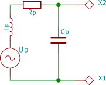
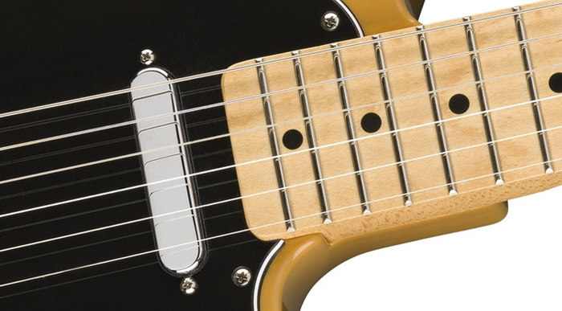
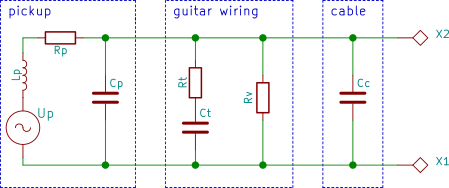
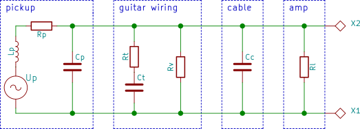
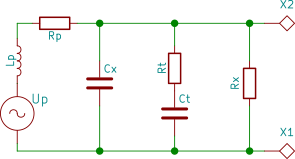
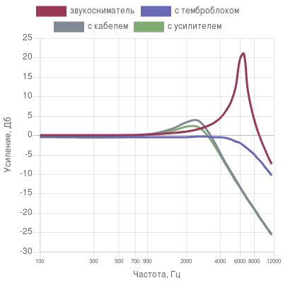
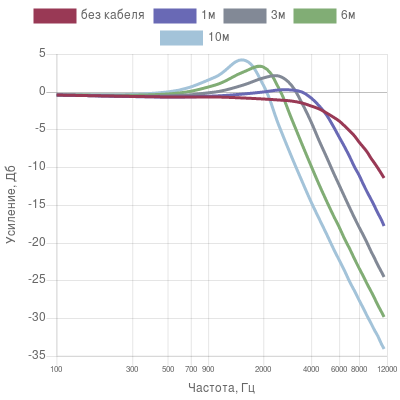
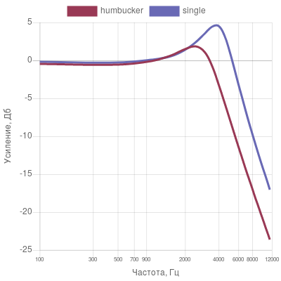
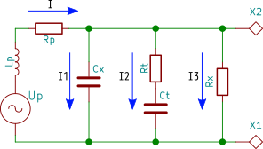

# Гитарный звук

В интернете есть множество статей и видеороликов с обзорами гитарного
оборудования, в большинстве из них выводы о звучании делаются на основе тестов,
полагаясь на слух автора и зрителя. В этой статье я хотел бы рассмотреть
формирование гитарного звука между звукоснимателем и входом в усилитель или звуковую
карту со стороны теории и показать как влияют разные компоненты системы на результат.

## Звукосниматели

Звукосниматель гитары - это по сути тонкий медный провод, намотанный на постоянный
магнит. Намагниченная стальная струна, колебаясь, создает переменное магнитное поле
ёв катушке, которое вызывает ЭДС (электродвижущую силу).
 
Так как провод тонкий и его очень много, то у него довольно большое активное
сопротивление, эта величина на сайтах производителей звукоснимателей обозначается
как *DCR* или *DC Resistance*, то есть сопротивление постоянному току.
Лежит в диапазоне от 6КОм у винтажных синглов до 22кОм у хамбакеров для
восьмиструнных гитар. 

Кроме сопротивления у нашего датчика есть индуктивность. На прохождение
постоянного тока она не влияет, с переменным все сложнее. Реактивное
сопротивление катушки индуктивности можно посчитать по формуле
$X_L = 2 \pi f L$, где $f$ --- частота в герцах, $L$ --- индуктивность, в Генри.
Индуктивность звукоснимателей производители не указывают, можно только померить
экспериментально. У синглов индуктивность 2-4 Генри,
у хайгейновых хамбакеров --- 8-10 [[1]][[2]][[3]]. Таким образом
на частоте 100 Герц реактивное сопротивление хамбакера будет 6КОм, а на частоте 10КГц ---
уже 600КОм, и хотя просто складывать с активным его нельзя, понятно, что оно
будет оказывать значительное влияние на выходной сигнал.

Еще у катушки индуктивности есть паразитная межвитковая емкость. Этот параметр
производители также не указывают. Посчитать, от чего зависит сложно, составляет
от 80 до 250пФ [[3]].

В итоге получаем следующую схему:

К сожалению это еще не всё, некоторые звукосниматели закрыты металлическими кожухами,
как, например, нековый датчик на гитаре fender telecaster. В металле возникают
токи Фуко, которые тратят энергию ЭДС на нагрев. Так как они сильнее проявляются на
высоких частотах, то видимо они будут их немного ослаблять. Конечно, сделано это специально,
чтобы получить нужный звук, так как никакой функциональной нагрузки они не несут, кроме,
может быть, улучшения внешнего вида. Далее я буду рассматривать только открытые
звукосниматели.

## Темброблок

Между звукоснимателем и выходом электрогитары обычно имеются регулировки громкости и тона.
Если зафиксировать переключатель звукоснимателей в одном положении, то в большинстве гитар
останется одна регулировка громкости и одна --- тона:

Можно еще упростить, зафиксировав ручки громкости и тона в максимальном положении, тогда получим:

В гитарах fender stratocaster обычно стоят потенциометры $R_v$ и $R_t$ по 250кОм и конденсатор $C_t$ ёмкостью
22нФ, в гитарах с хайгейновыми хамбакерами номиналы потенциометров больше --- по 500кОм. 

## Провод
О кабелях наверное больше различных мифов и заблуждений, чем обо всем остальном. Но опять,
посмотрим, какие параметры у них есть и что действительно нужно учитывать в нашем случае.

Активное сопротивление инструментальных кабелей небольшое, например у
[Klotz AC104](https://shop.klotz-ais.com/5668-ac104.html) (я привожу в качестве примера
кабели Klotz, потому что для них производитель указал больше всего параметров)
сопротивление 85Ом на километр длины. У десятиметрового кабеля будет чуть меньше
одного Ома, и, так как оно подключается последовательно нагрузке в сотни килоом,
его можно не учитывать.

Индуктивность гитарных кабелей тоже не пишут. формулу для вычисления и калькулятор можно найти
[здесь](https://www.allaboutcircuits.com/tools/coax-inductance-calculator/). Получается,
что индуктивность трехметрового кабеля около 1мкГн. Она подключается последовательно
с индуктивностью звукоснимателя, так что суммарная будет всего на 0.0001\% больше. Так что
этом параметром тоже можно пренебречь.

Вот емкость кабеля для нашей схемы сущестенная. У недорогого
[Klotz KiK](https://shop.klotz-ais.com/5606-kik.html) --- 115пФ/м, у самого дорогого от того
же производителя [Klotz Titanium](https://shop.klotz-ais.com/6247-titanium-pp.html) --- 75пФ/м.
Добавив ее на схему получим:

Конечно, есть еще один параметр кабеля --- то, насколько хорошо экранирован центральный
проводник, но полезный сигнал это сильно не меняет, просто добавляет немного шума, если
кабель плохой.

Все сказанное в этой главе относится только к подключению гитары с пассивными звукоснимателями
к усилителю, примочке или звуковой карте. Если мы, к примеру, подключим кабинет к усилителю
этим же кабелем, то на первое место выйдет активное сопротивление кабеля, а емкость на звук
будет влиять очень слабо.

## Усилители, звуковые карты

То, что происходит во входном каскаде усилителя находится за рамками этой статьи, попробуем
заменить его активной нагрузкой. К счастью производители иногда указывают входное сопротивление
своих продуктов. В таблице приведены входные сопротивления некоторый популярных усилителей,
примочек и звуковых карт:

| Устройство | Входное сопротивление, кОм |
|----------|----------------------------|
| Marshall VVM410H | 470 |
| Yerasov Detonator | 1000 |
| Marshall Jackhammel | 1000 |
| Boss MetalZone MT-2 | 1000 |
| Ibanez TubeScreamer TS9 | 500 |
| E-MU 0202 | 1000 |
| M-Audio M-Track 2x2 | 1000 |
| Tascam US 1x2 (inst) | 1000 или больше |
| Tascam US 1x2 (line) | 10 |

Добавим в нашу схему

## Анализ, выводы

В полной схеме паразитная емкость конденсатора подключается параллельно емкости кабеля,
заменим их конденсатором $C_x = C_p + C_c$. Нагрузка усилителя тоже подключается параллельно
потенциометру регулировки громкости, заменим на $R_x = \frac{R_v R_l}{R_v + R_l}$

Эту схему можно проанализировать (link to app). Чтобы посмотреть на получающиеся АЧХ для
разных параметров можно возпользоваться [калькулятором](http://guryanov.org/pickup-calculator/).

Во-первых, посмотрим, как меняется сигнал при постепенном подключении ступеней нашей цепочки

Когда к звукоснимателю ничего не подключено имеется ярко выраженный резонансный пик, видимо
именно его указываются производители датчиков. Темброблок полностью убирает резонансный пик
(в случае слабых синглов небольшой все же останется). Кабель сильно сдвигает всю АЧХ в сторону
низких частот. И, наконец, подключение усилителя немного ослабляет высокие частоты.

Посмотрим, на что влияет длина кабеля

При увеличении длины кабеля резонансный пик увеличивается, сдвигается в сторону низких частот
и правая часть спектра начинает срезаться на более низкой частоте.

Посмотрим теперь, на что влияет сопротивление нагрузки

Увеличение нагрузки (уменьшение сопротивления) немного уменьшает резонансный пик и ославляет
высокие частоты. К тому же отлично согласуется с опытом пример неправильного подключения
гитары к компьютеру --- в line in вместо инструментального или Hi-Z входа: высокие частоты ослаблены
гораздо сильнее, чем низкие.

Также понятно, что нет никакой проблемы при подключении Y-кабелем гитары в несколько
устройств. Например, можно подключить к звуковой карте и усилителю, чтобы записывать DI-сигнал
и мониторить обработанный звук (с перегрузом и эффектами) без задержки. Желательно выбрать
устройства с большим входным сопротивлением.

Cравним сингл с хамбакером

Ну и напоследок небольшой тест --- сравним стандартный гитарный кабель емкостью 530пФ
с вот таким:

Емкость этого кабеля около 20пФ. Получается он практически не будет сдвигать резонансный
пик отдельно стоящего звукоснимателя и разница в звуке будет очень сильная

<iframe width="560" height="315" src="https://www.youtube.com/embed/e7yZHgVqSAg" frameborder="0"></iframe>

У сингла гораздо выше резонансный пик и высокие частоты срезаются правее на АЧХ. Примерно такая
же ситуация будет, если сравнить "мощный" хамбакер с "винтажным". В реальности разница
между синглом и хамбакером будет еще и из-за того, что хамбакер получает магнитное поле
из двух точек, а сингл --- из одной.

Конечно производители гитарного оборудования знают свое дело и рассчитывают свои продукты
так, чтобы оно хорошо работали в цепи. Гитарный мастер не будет паять схему так, чтобы
она хорошо звучала при подключении в line-in сетевым проводом, потому что все гитаристы
подключаются в усилитель гитарным кабелем. Но если что-то в звуке не устраивает вполне
можно немного подумать и заменить именно то что нужно и не смотреть при этом тысячи
видеороликов с обзорами. К примеру, хочется вам больше высоких частот --- нужно купить
кабель с меньшей емкостью, или отрезать от своего половину, или поставить датчик с более
слабым выходом, или, если сопротивление нагрузки не очень большое, можно попробовать
поставить потенциометр ручки громкости с большим номиналом.

### Некоторые выводы и мысли:

* Несмотря на все аргументы противников аудиофилов, в случае гитар звук действительно сильно
зависит от кабеля. Но не от количества золота и платины в нем, а от конструкции кабеля и
материала диэлектрика. Определяется всего лишь одним параметром --- ёмкостью, легко измеряется
мультиметром с функцией измерения ёмкости.
* Все компоненты системы влияют только на высокие частоты, больше ~700Гц.
* Всем обзорщикам гитар крайне желательно уделять особое внимание кабелю и подключаться
стандартным трехметровым, а еще лучше писать ёмкость или хотя бы модель кабеля.
* Тесты в которых авторы на слух тестируют 10 кабелей и делают какие-то выводы бессмысленны
* Чем короче кабель, тем меньше он влияет на звук. Шестиметровый Klotz Titanium за 100€
изменит звук сильнее, чем трехметровый Klotz Kik за 15€. Но при этом если понадобился
кабель большей длины имеет смысл купить модель с меньшим значением емкости.
* Лучше покупать кабели, для которых указана емкость, либо ходить в магазин с
мультиметром с возможностью измерения емкости, так можно будет избежать неожиданностей.
* Привести звучание короткого и дорогого кабеля к длинному и дешевому можно припаяв конденсатор
соответствующей емкости параллельно выходу гитары. Обратно --- нельзя никак без активных компонент.
* Если хочется подключить гитару на сцене к усилителю, который стоит очень далеко, возможно имеет
смысл воткнуть ее сначала в выключенную примочку с активным байпассом либо в буфер.

## Ссылки

* Формирование сигнала в звукоснимателе --- <http://www.till.com/articles/PickupResponse/index.html>
* Самая полная модель электрогитары, парни учли все что только возможно --- <http://guitarnuts2.proboards.com/thread/3627>
* Мой калькулятор --- <http://guryanov.org/pickup-calculator/>
* Исходники калькулятора --- <https://github.com/dmitry-guryanov/pickup-calculator>

## Расчет схемы

Воспользуемся методом комплексных амплитуд (link). По правилам Кирхгофа получим систему уравнений

\\[
\\begin{cases}
I = I_1 + I_2 + I_3
\\\\
\\frac{I_1}{i\\omega C_x} = I_2(R_t + \\frac{1}{i\\omega C_t}) = I_3 R_x
\\\\
U_p = I i\\omega L_p + IR_p + I_3 R_x
\\end{cases}
\\]

Решение:

\\[
I_1 = I_3 i\\omega C_x R_x
\\\\
I_2 = I_3 \\frac{R_x}{R_t + \\frac{1}{i\\omega C_x}}
\\\\
I = I_3(i\\omega C_x R_x + \\frac{R_x}{R_t + \\frac{1}{i\\omega C_x}} + 1) = a I_3
\\\\
U_p = I(i\\omega L_p + R_p + \\frac{R_x}{a})
\\]

Нас интересует отношение падение напряжения на $R_x$ ко входному $U_p$, которое равно

\\[
K = \\frac{I_3 R_x}{U_p} = \\frac{\\frac{I}{a}R_x}{U_p} = \\frac{R_x}{ia \\omega L_p + aR_p + R_x}
\\]

Прежде, чем подставить $a$, преобразуем:

\\[
\\frac{R_x}{R_t + \\frac{1}{i\\omega C_x}} = \\frac{i \\omega C_t R_x}{1 + i \\omega C_t R_t} =
\\frac{i \\omega C_t R_x (1 - i \\omega C_t R_t)}{1 + \\omega^2 C_t^2 R_t^2} =
\\frac{\\omega C_t R_x(i + \\omega C_t R_t)}{1 + \\omega^2 C_t^2 R_t^2} = b \\omega C_t R_x(i + \\omega C_t R_t)
\\]

Подставим $a$ в знаменатель формулы для $K$:

\\[
ia \\omega L_p + aR_p + R_x = (i\\omega L_p + R_p)(i \\omega C_x R_x + b\\omega C_t R_x (i + \\omega C_t R_t) + 1) + R_x =
\\\\
(R_p + R_x - \\omega^2 R_x(L_p C_x + b C_t(L_p - C_t R_t R_p))) + i(\\omega(L_p + C_x R_x R_p + bC_t R_x(R_p + \\omega^2 L_p R_t C_t))) =
\\\\
x + iy
\\]

Так как нас интересуем амплитуда напряжения на $Rx$, то

\\[
K_a = \\sqrt{KK^\\ast} = \\frac{R_x}{\\sqrt{x^2 + y^2}} =
\\\\
\\frac{1}{\\sqrt{(\\frac{R_p}{R_x} + 1 - \\omega^2(L_p C_x + b C_t(L_p - C_t R_t R_p))^2 +
\\omega^2 (\\frac{L_p}{R_x} + C_x R_p + bC_t(R_p + \\omega^2 L_p R_t C_t))^2}}
\\]

где
\\[
b = \\frac{1}{1 + \\omega^2 C_t^2 R_t^2}
\\]

[1]: http://www.planetz.com/pickup-inductance/
[2]: http://www.billlawrence.com/Pages/Pickupology/output_sonic_evaluation.htm
[3]: https://www.buildyourguitar.com/resources/lemme/table.htm
